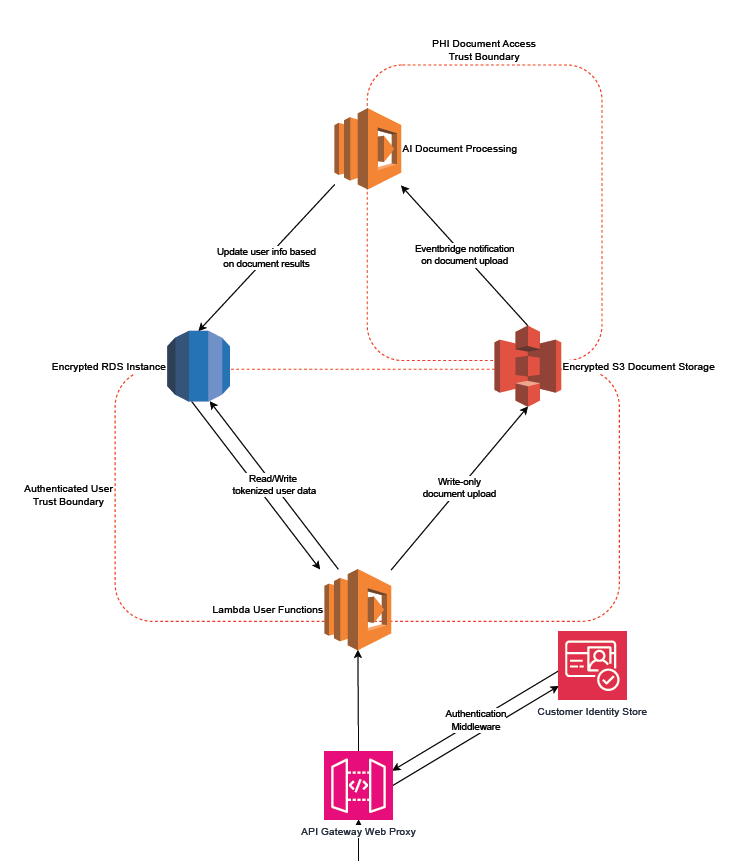

# CSC603 Final - Group 2

Cloud-native application designed to run via AWS Lambda
Designed for security and scalability.

## Overview
This application is designed to securely store Protected Health Information (PHI) for end users, implementing a robust security framework to protect sensitive data. 

## Features

### Security-First Architecture
- **Language:** Built using **Rust** to ensure memory safety and mitigate vulnerabilities like buffer overflows.

### Data Tokenization
- **Method:** User information is tokenized using **SHA-256 hashing** combined with unique salts for each user, enhancing protection against data breaches.

### AWS Cognito Authentication
- **Authentication:** Utilizes **AWS Cognito** for user authentication, enforcing **Multi-Factor Authentication (MFA)** to ensure that only authorized users can access the application.

### Query Isolation
- **Access Control:** Locked to **single user-specific queries**, preventing database exfiltration and ensuring that users can only access their own data.

### Data Segregation
- **Privacy:** Complete segregation of PHI so that no single process has full access to end-user data or personally identifiable information (PII), limiting exposure in case of a breach.

## Architecture

## Cost Savings and Enhanced User Experience

Preventing the leakage of Protected Health Information (PHI) not only safeguards sensitive data but also translates into significant long-term cost savings for our customers. By implementing robust security measures, organizations can avoid the hefty fines and legal fees associated with data breaches, which can easily escalate into millions of dollars. Furthermore, the trust and confidence gained from securing PHI fosters customer loyalty and retention, ultimately enhancing revenue streams.

In addition to financial benefits, our product's **high availability** and **scalability** ensure a responsive and seamless user experience. With architecture designed to handle increased loads efficiently, users can access their data without interruptions, even during peak times. This reliability minimizes downtime and enhances productivity, making it easier for healthcare providers to deliver quality care. Together, these features create a secure, efficient, and user-friendly environment that empowers customers while protecting their most sensitive information.